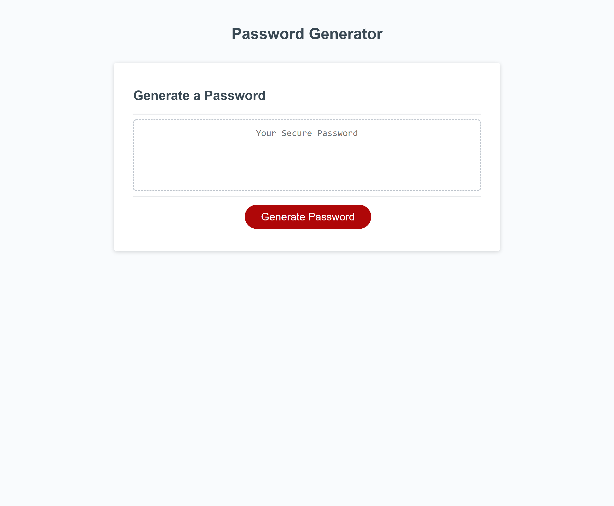

# Random Password Generator

## Table of Content
1. [Description](#description)
2. [Visuals](#visuals)
3. [Credits](#credits)

## Description
[Random Password Generator]()
 
The random password generator website was built so that users may obtain a randomly
generated password according to their specifications.\
When a users clicks on the Generate Password button a box will pop up asking for specifications.\
Users may choose a length between 8-128 characters.\
Users then choose to include or not include uppercase letters, lowercase letters, numbers, and special characters.\
Users will then be presented with their new randomly generated password.\
 
All steps are logged within the console log for users to check.

## Visuals

## Credits
Christian Hoffman